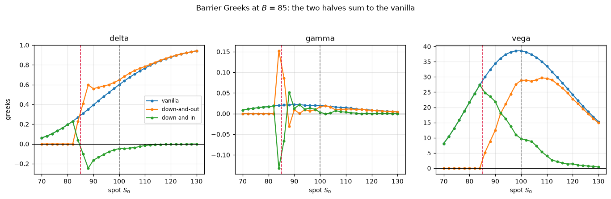

# mc-exotics-greeks

몬테카를로로 digital·barrier 옵션의 가격과 Greeks를 구하고, closed form과 contractual equation으로 결과를 검증합니다.



## 과제 개요

U.FE.A 금융공학 학회 2026년 하반기 6주차 실습과제입니다. 팀장으로서 과제를 설계했고, 이 저장소는 그 해답본을 패키지로 정리한 것입니다. 과제 마감(2026-09-05)이 지나 공개합니다.

앞선 과제들은 closed form이 있는 상품을 다뤘습니다. 이번 과제는 같은 가치평가 원리를 몬테카를로로 옮기고, closed form이 없는 경로의존 상품까지 넓힙니다.

| 섹션 | 가격 | Greeks |
|---|---|---|
| payoff가 만기값만 봄 | 1. digital call | 2. digital call |
| payoff가 경로 전체를 봄 | 3. down-and-out / down-and-in call | 4. down-and-out / down-and-in call |

## 접근 방식

닫힌 해가 있는 곳에서는 통계적으로 검증하고, 없는 곳에서는 항등식으로 검증합니다.

**closed form이 있을 때.** 몬테카를로 추정치는 확률변수라서 참값과 정확히 같을 수 없습니다. 그래서 상대오차 대신 표준오차 몇 배만큼 떨어져 있는지(`z`)를 봅니다. `|z| < 3`이면 몬테카를로 오차 안에서 일치한다고 판단합니다.

**closed form이 없을 때.** 이산 관찰 배리어 옵션은 여기서 쓸 수 있는 닫힌 해가 없습니다. 대신 같은 경로에서는 down-and-out과 down-and-in 중 하나만 payoff를 받으므로 다음 식이 경로마다 성립해야 합니다.

$$C_{\text{down-and-out}} + C_{\text{down-and-in}} = C_{\text{vanilla}}$$

이 식은 통계적 근사가 아니라 항등식이므로 잔차가 부동소수점 수준이어야 합니다. 두 payoff는 각자의 배리어 조건으로 따로 정의했습니다. vanilla에서 빼서 정의하면 식이 정의상 성립해 검증 의미가 없어집니다. 여기에 vanilla call의 MC 가격을 Black-Scholes와 비교해 경로 생성 자체를 따로 확인합니다.

**Greeks.** 중심차분(bump-and-revalue)으로 구하고, 다섯 번의 재평가에 같은 난수를 넘깁니다(common random numbers). 난수를 매번 새로 뽑으면 독립적인 두 오차를 작은 bump로 나누게 되어 노이즈가 커집니다. 미분은 선형이므로 contractual equation은 Greeks에서도 성립하고, 이것도 검증에 씁니다.

## 구현

```
mc-exotics-greeks/
├── src/mc_exotics/
│   ├── paths.py        GBM 만기값(정확해), 다중 스텝 경로(로그 증분 누적합)
│   ├── payoffs.py      digital, vanilla, down-and-out, down-and-in payoff와 pricer
│   ├── analytic.py     Black-Scholes, digital call의 가격·Greeks closed form
│   ├── greeks.py       중심차분 Greeks (CRN)
│   └── stats.py        표본평균과 표준오차
├── notebooks/mc_exotics.ipynb    설명용 노트북 (실행 출력 포함)
├── tools/build_assignment.py     해답본에서 과제본을 만드는 변환기
├── figures/                      노트북이 저장한 그림
└── tests/
```

- 모든 계산은 NumPy 배열 연산입니다. 경로를 반복문으로 하나씩 돌지 않습니다. 20,000개 경로 × 252스텝 행렬 하나가 40MB입니다.
- 가격 계산 라이브러리(QuantLib 등)는 쓰지 않습니다. closed form도 `scipy.stats.norm`만으로 구현했습니다.
- `fd_greeks`는 `price_fn(spot, vol, Z)` 형태의 함수면 무엇이든 받습니다. `barrier_prices`가 세 상품 가격을 배열로 돌려주므로 한 번 호출로 세 상품의 Greeks가 함께 나옵니다. 섹션 4에 새 코드가 없는 것은 이 구조 때문입니다.

### 과제 빌드 도구

`tools/build_assignment.py`는 학회원에게 배포할 빈칸본을 해답 노트북에서 기계적으로 만듭니다. 해답 코드는 `# <<<SOL n=1` ... `# SOL>>>` 마커로 감싸 두고, 빌드하면 마커 안쪽만 `...`으로 바뀝니다. 마커 밖은 한 글자도 바꾸지 않고 복사하므로 해답본을 고치면 과제본도 그대로 따라갑니다. 손으로 두 파일을 따로 고치다 어긋나는 일을 막으려고 만들었습니다. `--check`는 빈칸 번호의 중복·누락과 안내 주석 누락을 검사합니다.

## 실행 결과

2026-09-30 `notebooks/mc_exotics.ipynb` 실행 출력 기준입니다. 파라미터는 S0 = K = 100, r = 3%, σ = 20%, T = 1년, B = 85, 무배당, seed 20260828입니다.

**closed form과 비교** (digital 500,000개 만기값, barrier 20,000개 경로 × 252일)

| 항목 | MC | closed form | z |
|---|---:|---:|---:|
| E[S_T] (만기값) | 103.011985 ± 0.029398 | 103.045453 | −1.14 |
| E[S_T] (경로) | 103.105418 ± 0.146192 | 103.045453 | +0.41 |
| digital call | 0.503815 ± 0.000686 | 0.504572 | −1.11 |
| vanilla call (배리어 경로 위) | 9.418209 ± 0.098788 | 9.413403 | +0.05 |

**Greeks 상대오차** (중심차분, h_S = 3, h_σ = 0.02)

| 상품 | delta | gamma | vega |
|---|---:|---:|---:|
| digital call (ATM) | 0.40% | 13.60% | 0.23% |
| digital call (곡선 31점, RMSE / 곡선 진폭) | 0.6% | 3.8% | 0.4% |
| vanilla call (ATM, 배리어 경로 위) | 0.13% | 1.12% | 0.22% |

**배리어 옵션 가격과 contractual equation**

| 항목 | 값 |
|---|---:|
| down-and-out call | 8.965702 ± 0.098961 |
| down-and-in call | 0.452507 ± 0.019277 |
| out + in | 9.418209 |
| vanilla call (같은 경로) | 9.418209 |
| 배리어 터치 비율 | 38.17% |
| 가격 잔차, 경로별 최대 | 0.000e+00 |
| 가격 잔차, 격자 31점 최대 | 7.105e-15 |
| Greeks 잔차, ATM 최대 | 2.842e-14 |
| Greeks 잔차, 격자 31점 최대 | 3.766e-13 |

## 결과 분석

closed form이 있는 네 값은 모두 `|z|`가 1.2 이하입니다. drift의 −σ²/2나 할인을 빠뜨리면 이 비교에서 바로 걸립니다(개발 방식 참고).

digital gamma의 ATM 상대오차 13.60%는 구현 오류가 아닙니다. 참값이 −0.000242로 작아 한 점 추정이 불안정합니다. 곡선 전체로 재면 진폭 대비 3.8%이고 그림에서도 점들이 closed form 선을 따라갑니다.

contractual equation 잔차는 가격에서 1e-15, Greeks에서 1e-13 수준입니다. 몬테카를로 표준오차(0.1 수준)보다 열 자릿수 이상 작으므로 통계 오차가 아니라 부동소수점 오차입니다.

그림에서 down-and-out은 배리어(85) 근처에서 delta가 꺾이고 gamma가 크게 튑니다. 배리어에 닿으면 계약이 사라지므로 가격이 그 지점에서 0으로 눌리기 때문입니다. gamma가 크면 헤지 수량을 자주 크게 바꿔야 하므로 배리어 근처의 dynamic replication 비용이 커집니다.

**한계.** 배리어는 일별 이산 관찰입니다. 연속 관찰 배리어의 닫힌 해와는 비교하지 않았습니다(과제 범위 밖). 중심차분은 h²에 비례하는 편향이 있고, 배리어 근처처럼 가격이 꺾이는 곳에서는 bump 크기에 민감합니다. 다음 단계로 pathwise·likelihood ratio 방식의 Greeks와 비교해 볼 수 있습니다.

## 이슈 기록

**digital gamma가 불안정함.** digital payoff는 불연속이라 gamma 차분이 노이즈에 약합니다. bump 크기와 경로 수를 바꿔 가며 쟀습니다.

| 경로 수 | h_S | ATM gamma 상대오차 | 곡선 gamma RMSE / 진폭 |
|---:|---:|---:|---:|
| 500,000 | 2 | 43.6% | 7.7% |
| 500,000 | 3 | 13.6% | 3.8% |
| 1,000,000 | 2 | 51.4% | 4.6% |
| 1,000,000 | 3 | 25.4% | 2.1% |

h_S = 3에서 곡선 오차가 절반으로 줄고, 같은 조건에서 delta·vega 곡선 오차는 0.6%, 0.4%로 유지됩니다. 경로 수를 두 배로 늘려도 곡선 오차는 3.8%에서 2.1%로 줄 뿐이라 500,000에서 멈췄습니다. ATM 한 점의 오차는 경로 수와 함께 줄지 않아서, 한 점 대신 곡선으로 판단하게 했습니다.

**전역 변수 의존.** 원래 해답 노트북의 pricer는 K, r, T, B를 전역 변수에서 읽었습니다. 패키지로 옮기면서 키워드 인자로 바꾸고, 노트북에서는 `functools.partial`로 계약 조건을 묶어 `fd_greeks`에 넘깁니다. 옮긴 뒤 노트북을 다시 실행해 원래 해답본과 출력 숫자가 모두 같은지 확인했습니다.

## 실행 방법

Python 3.10 이상.

```bash
pip install -e ".[dev]"
pytest
```

노트북과 그림을 다시 만들려면:

```bash
pip install -e ".[notebook]"
cd notebooks
python -m nbconvert --to notebook --execute --inplace mc_exotics.ipynb
```

노트북 전체 실행은 약 30초 걸립니다(2026-09-30, 로컬 PC 기준). 대부분은 섹션 4의 Greeks 곡선 셀입니다.

과제 빌드 도구:

```bash
python tools/build_assignment.py --solution <해답.ipynb> --check
python tools/build_assignment.py --solution <해답.ipynb> --out <과제.ipynb>
```

## 개발 방식

과제 설계와 해답 코드는 직접 작성했습니다. 저장소 정리에는 Claude Code를 썼습니다. 해답 스크립트를 `src/mc_exotics/` 모듈로 나누는 일부터 테스트 작성, CI 설정, README 초안까지 맡겼습니다.

검증은 이렇게 했습니다.

- 패키지로 옮긴 뒤 노트북을 처음부터 다시 실행하고, 출력 숫자를 원래 해답 노트북 출력과 하나씩 대조했습니다. 모두 일치했습니다.
- README의 수치는 모두 위 노트북 실행 출력과 이슈 기록용 재계산 결과에서 옮겼습니다.
- 테스트가 실제로 오류를 잡는지 보려고 구현을 일부러 망가뜨려 돌려 봤습니다. drift의 −σ²/2 누락(만기값, 경로 각각), knock-in 조건 변경, digital 할인 누락 네 경우 모두 테스트가 실패했습니다.

`tests/`의 테스트:

| 테스트 | 확인 내용 |
|---|---|
| `test_digital_mc_matches_closed_form` | digital MC 가격이 closed form과 \|z\| < 3 |
| `test_in_out_parity_holds_path_by_path` | out + in − vanilla 잔차 < 1e-10 (가격, Greeks) |
| `test_same_seed_gives_identical_results` | 같은 seed 두 번 실행 시 완전히 같은 값 |
| `test_vanilla_fd_greeks_within_3_se_of_black_scholes` | vanilla delta·vega가 Black-Scholes와 3 SE 이내 |
| `test_paths_start_at_spot_and_have_expected_shape` | 경로 shape와 첫 열 |
| `test_terminal_mean_is_martingale` | E[S_T]가 S0·e^{rT}와 \|z\| < 3 |
| `test_build_assignment.py` | 빌드 도구가 해답만 지우고 나머지는 그대로 두는지, 잘못된 마커를 거부하는지 |
